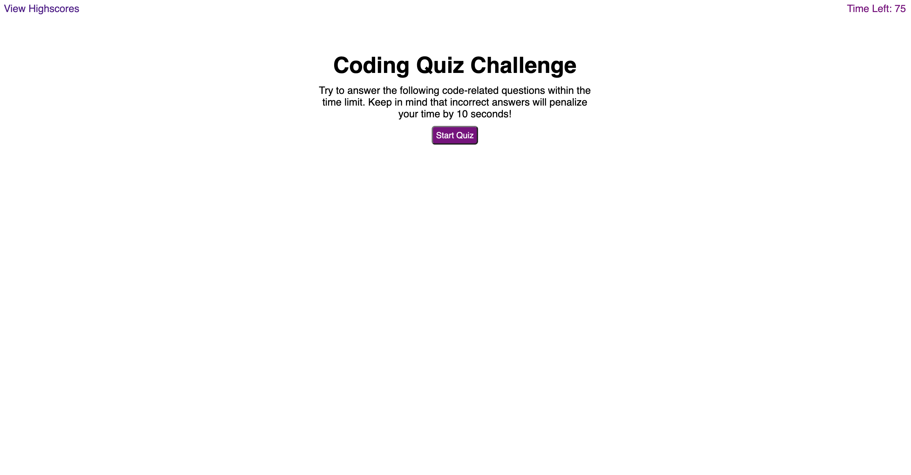

# Coding Bootcamp Week 4 Challenge

## Description

This challenge focused on creating the code for a quiz website. JavaScript, HTML and CSS were used to create the website.

## Usage

To access this webpage, follow the link below and view the webpage, click start and answer the questions.

## Link

Below is the link to the webpage

https://brodie02.github.io/bootcamp-challenge4/
      
---
